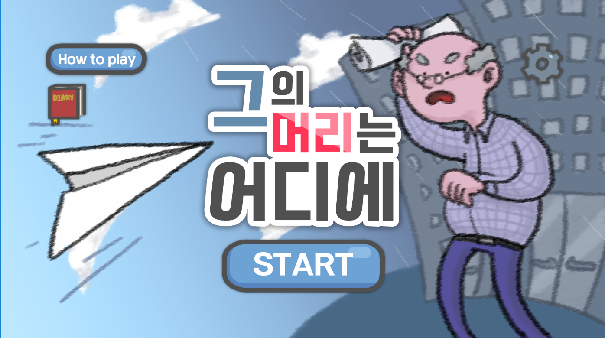
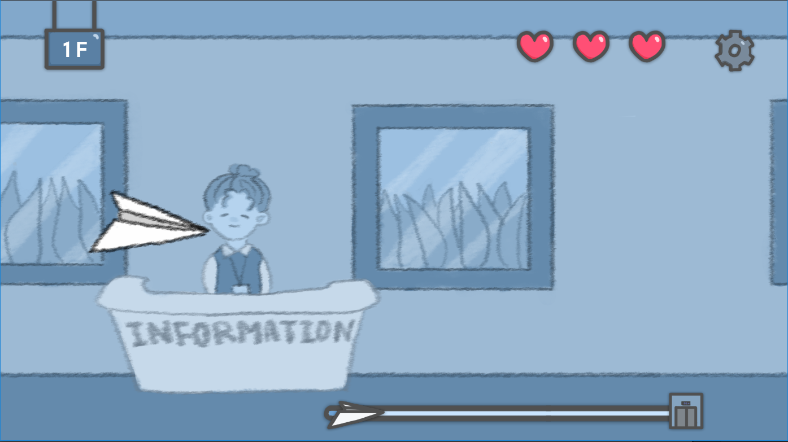
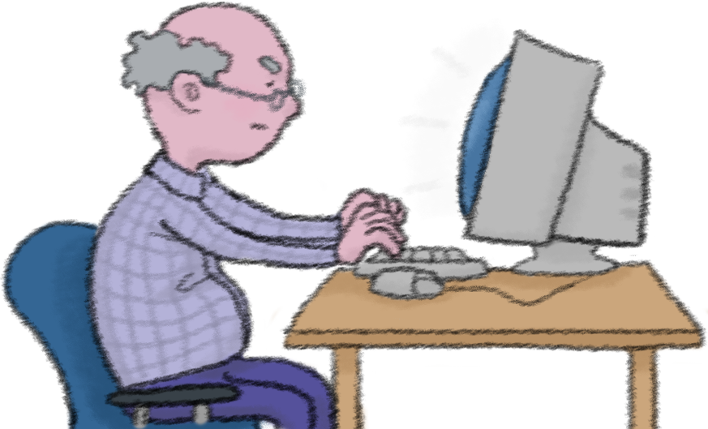

# PaperPlane
비행기를 날려 부장님의 머리에 맞추는 횡스크롤 게임

## 팀원
기획 : 오예진

아트 : 사은우

개발 : 조용진, 김태홍

## Gameplay
**아트로 나올 예정**

  <How to play>

  ‘그’의 머리로 향하는 조종법

  1.	화면을 터치하면 비행기가 위로 뜬다. 

  비행기가 천장에 닿거나 바닥으로 떨어지면 목숨 한 개를 잃으므로, 적당히 조절하여 비행기를 띄워주어야 한다.

  (아트 들어갈 부분)(비행기 이미지)

  2.	각 층에 비치된 물건들과 부딪치지 않도록 타이밍을 잘 맞추어 비행기를 띄워주어야 한다.

  1층: 회사 로비 2층: 식당 3층: 사무실 부서 4층: 사장실(별표 표시)

  3.	목숨은 3개가 주어진다. 비행기의 수명이 닳기 전에 엘리베이터에 도달해보자. 

  (아트 들어갈 부분)(하트 이미지)

  4.	하단 바에서 앞으로 남은 거리를 알 수 있다. 부장님에게 무사히 도착해 복수에 성공하자!  

  (아트 들어갈 부분)(하단 바 이미지)

## 게임 이미지

메인화면

스토리

인게임

부장님

## 게임 다운로드

[source]()
